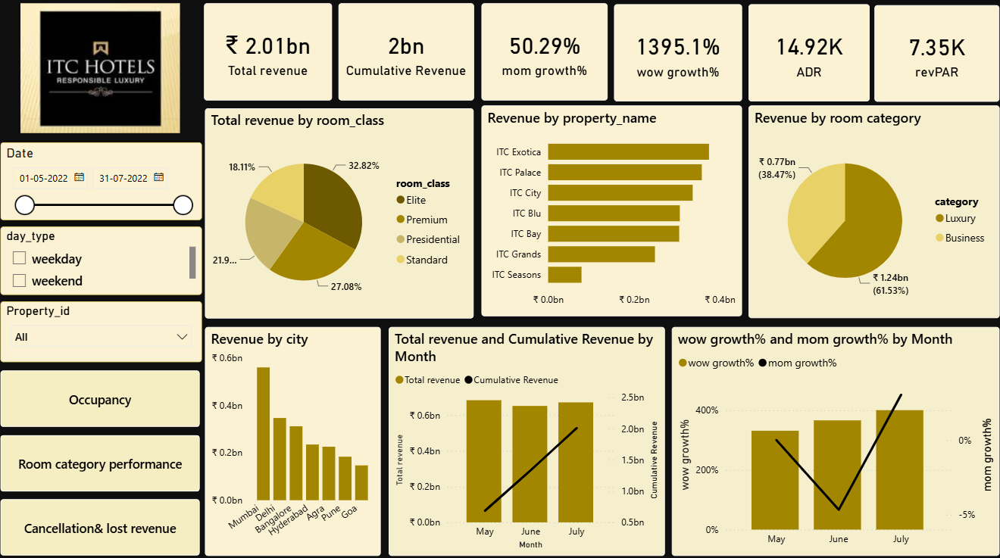
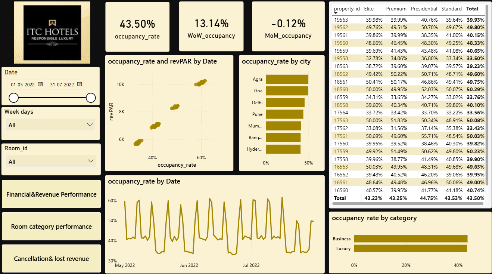
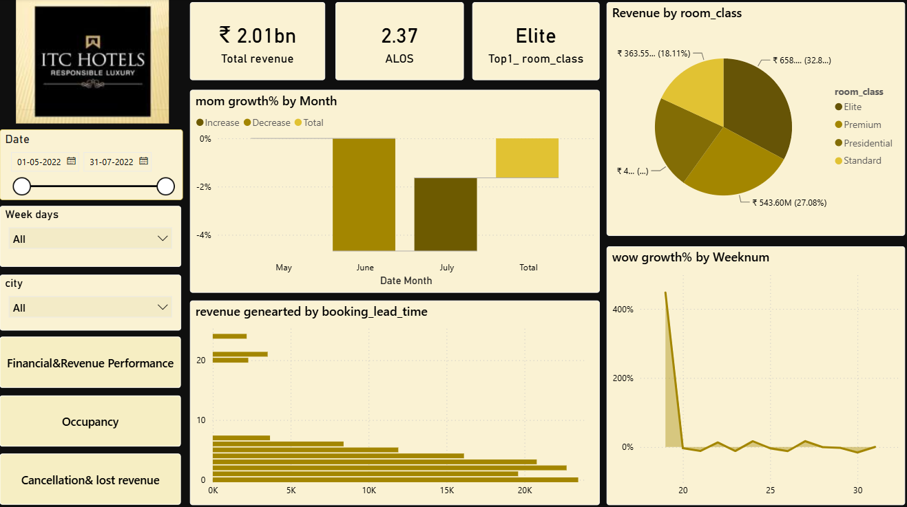
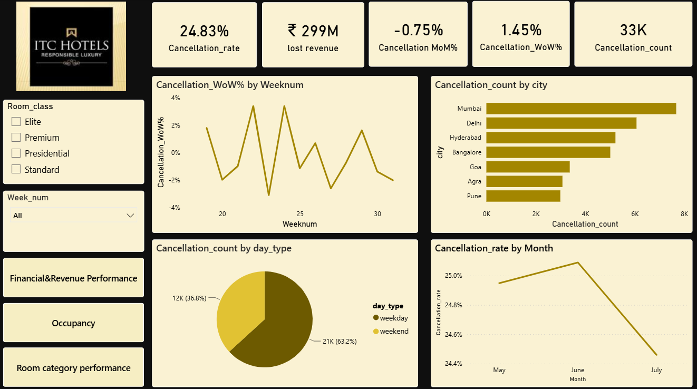

# itc-hotels-revenue-occupancy-analysis
Hospitality analytics dashboard tracking ₹2.01B revenue, RevPAR, ADR, occupancy dynamics, and cancellation metrics for ITC Hotels.

# ITC Hotels: Revenue, Occupancy & Cancellation Analytics Dashboard

## 📌 Project Overview
A multi-dimensional hospitality analytics dashboard developed to evaluate financial performance, occupancy trends, room class demand, and cancellation behavior across ITC Hotels' luxury properties. The project translates key hospitality metrics (RevPAR, ADR, ALOS) into actionable strategies for yield management and booking optimization.

---

## 📊 Dashboard Previews

### 1. Financial & Revenue Performance

### 2. Occupancy & Capacity Analysis

### 3. Room Performance & Booking Trends

### 4. Cancellation & Lost Revenue Analysis

---

## 🔍 Key Hospitality Metrics Tracked
* **Revenue Metrics:** Total Revenue, Cumulative Growth, Month-over-Month (MoM), and Week-over-Week (WoW) Growth.
* **Pricing & Yield KPIs:** Average Daily Rate (ADR) and Revenue per Available Room (RevPAR).
* **Operational KPIs:** Occupancy Rate, Average Length of Stay (ALOS), and Booking Lead Time.
* **Risk & Loss KPIs:** Cancellation Rate, Cancellation Volume, and Total Lost Revenue.

---

## 📈 Key Findings & Insights
* **Financial Performance:** Generated **₹2.01 Billion** in total revenue with an ADR of **₹14.92K** and RevPAR of **₹7.35K**. Luxury properties accounted for **61.5%** of revenue, led by *ITC Exotica* and the Mumbai market.
* **Room Class Preference:** *Elite Rooms* contributed the highest revenue share (**32.8%**), with longer booking lead times strongly correlating with higher total spend.
* **Occupancy Trends:** Maintained an average occupancy rate of **43.50%**, with **Agra** demonstrating the highest property occupancy and the *Business* segment leading capacity utilization.
* **Cancellation Impact:** Identified a **24.83% cancellation rate** representing **₹299 Million** in lost revenue (33,000 canceled bookings), with weekday cancellations and Mumbai properties showing the highest drop-off rates.

---

## 💡 Strategic Recommendations
* **Yield Optimization:** Capitalize on advance bookings in the *Elite* class with dynamic pricing to maximize ADR during high-demand windows.
* **Cancellation Reduction:** Implement tiered deposit policies and non-refundable discount rates for weekday corporate bookings in high-cancellation cities like Mumbai.
* **Occupancy Balancing:** Drive targeted weekend leisure packages in business-centric properties to lift the overall 43.5% baseline occupancy.

---

## 📁 Repository Contents
* `ITC_Hotels_Hospitality_Analysis.pdf` - Project presentation slides.
* `*.png` - High-resolution dashboard visuals.
